# Lab Report 2
## Part 1
Code for my Simplest Search Engine
```
import java.io.IOException;
import java.net.URI;
import java.util.ArrayList;

class Handler implements URLHandler {
    // The one bit of state on the server: a number that will be manipulated by
    // various requests.
    int num = 0;
    ArrayList<String> str = new ArrayList<>();

    public String handleRequest(URI url) {

        if (url.getPath().equals("/")) {
            return String.format("Number: %d", num);
        } else if (url.getPath().equals("/increment")) {
            num += 1;
            return String.format("Number incremented!");
        } else {
            System.out.println("Path: " + url.getPath());
            if (url.getPath().contains("/add")) {
                String[] parameters = url.getQuery().split("=");
                if (parameters[0].equals("count")) {
                    num += Integer.parseInt(parameters[1]);
                    return String.format("Number increased by %s! It's now %d", parameters[1], num);
                } else if(parameters[0].equals("s")) {
                    str.add(parameters[1]);
                    return String.format("Word added.");
                }
            } else if (url.getPath().contains("/search")) {
                String[] parameters = url.getQuery().split("=");
                ArrayList<String> output = new ArrayList<>();
                for(String word : str) {
                    if(word.contains(parameters[1])) {
                        output.add(word);
                    }
                }
                
                if(output.size() == 0) {
                    return String.format("No Match");
                } else {
                    return output.toString();
                }
            }
            return "404 Not Found!";
        }
    }
}

class SearchEngine {
    public static void main(String[] args) throws IOException {
        if(args.length == 0){
            System.out.println("Missing port number! Try any number between 1024 to 49151");
            return;
        }

        int port = Integer.parseInt(args[0]);

        Server.start(port, new Handler());
    }
}
```

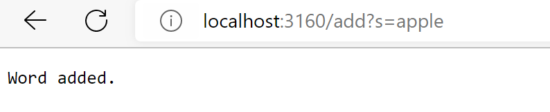<br />
To add the word apple, the main method is called. Then handleRequest is called. The url is passed into the handleRequest method. An arraylist of string named *str* is created with empty value. With *"/add"* and *"s"* present in the url, the word *"apple"* after *"="* is added to the *str*. Now *str* stores one element. *str* still holds one element after the request is done. 

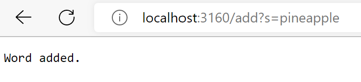<br />
I added another word. The process is most the same as described above. *str* now will hold two elements and will not change after the request is done.

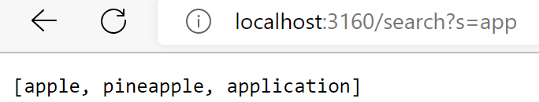<br />
I added a few other words and then did a search for the words contain *"app"*. Since the url now contains the key word *"/search"*, it passes the if statement for search. A new arraylist of string named *"output"* is created to temporarily hold value that matches requirement. All the words in the variable *"str"* will go through the loop. The ones that contains *"app"* will be added to the *"output"*. The output is printed on the webpage at the end. After the request is done. *"str"* will not change, but *"output"* will be cleared. 


## Part 2
**Bug1**<br>
Input test code for bug 1.<br>
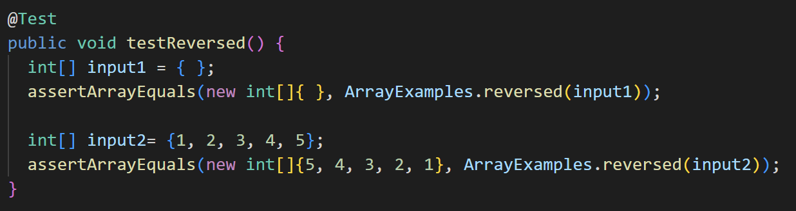<br>

Symptom for bug 1.<br>
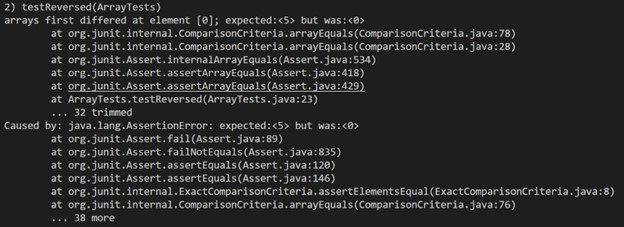<br>

Code for bug 1.<br>
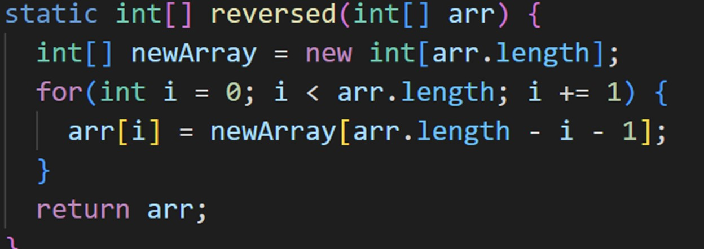<br>

Fixed code for bug 1.<br>
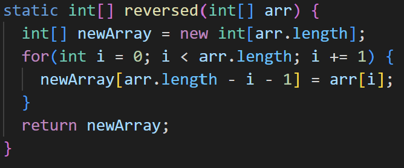<br>
The test is a basic reversed list test. The failed output is showing that the expected output should be 5 but the actual output is 0. This is caused by two bugs from the original code. Firstly, the code assigned value in the empty int list *newArray* to the input list *arr*. This makes *arr* also become an empty list. Secondly, it returns *arr*. Therefore the first element of the actual output is zero. To fix the bug, *newArray* should copy element from *arr* and then return *newArray*, as shown in the image Fixed code for bug 1.

**Bug2**<br>
Input test code for bug 2.<br>
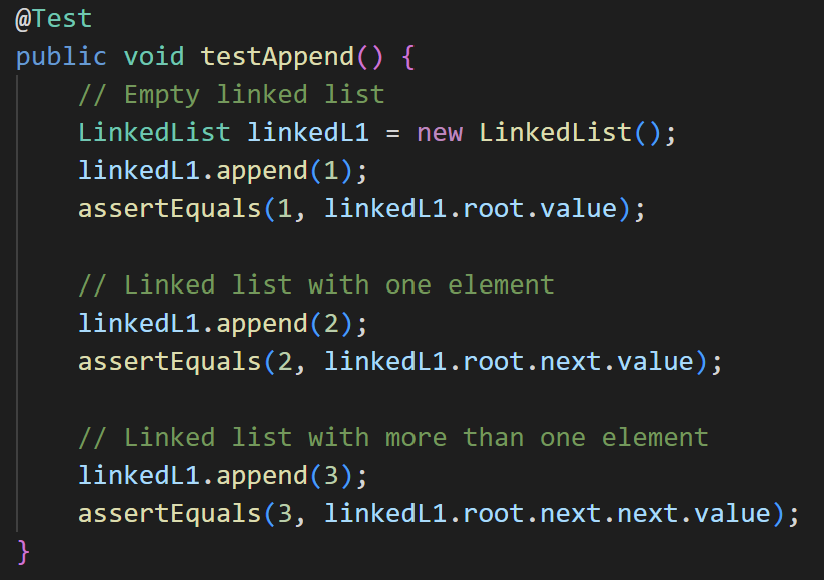<br>
Symptom for bug 2.<br>
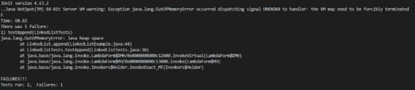<br>
Code for bug 2.<br>
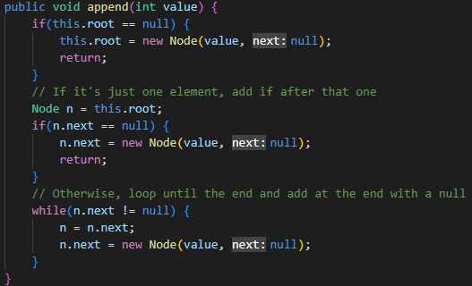<br>
Fixed code for bug 2.<br>
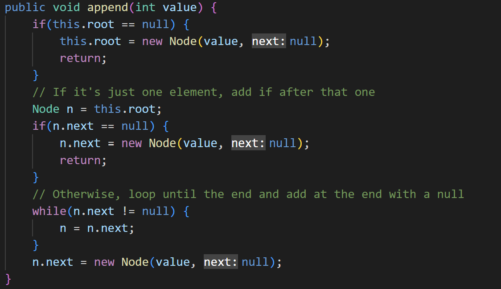<br>
The code causes an OutOfMemoryError. When there are more than one element in the linked list, the code will enter the while loop when running. The condition for the while loop to run is the *n.next* value is not null. In the loop body, *n.next* is always assigned with a new Node. This means the code will always satisfy the condition that *n.next* is not null. Therefore the while loop will run infinitely until the computer runs out of memory and cuases an error. The while part of the loop is to loop to the end of the linked list so that it can add a node at the end. To do this, just move the second line out of the loop after the while loop, as shown in Fixed code for bug 2. While loop will break after it reaaches the last node and a new node can be added. 
