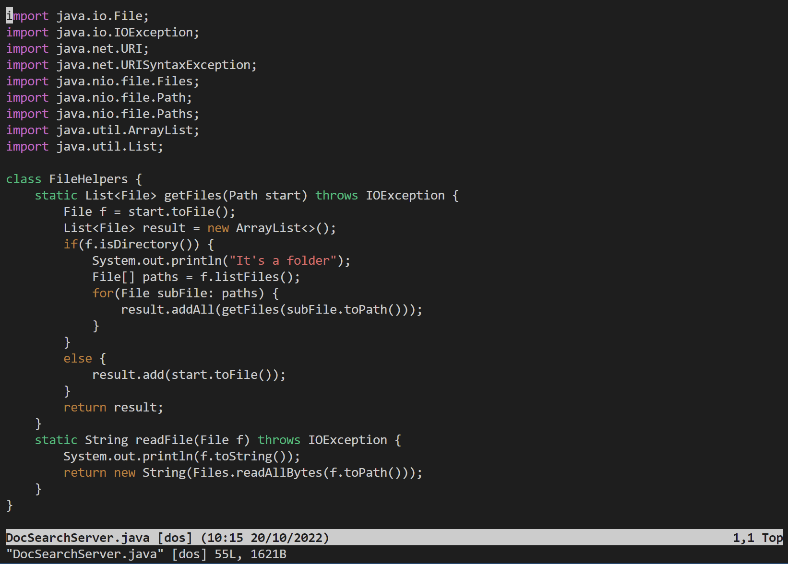
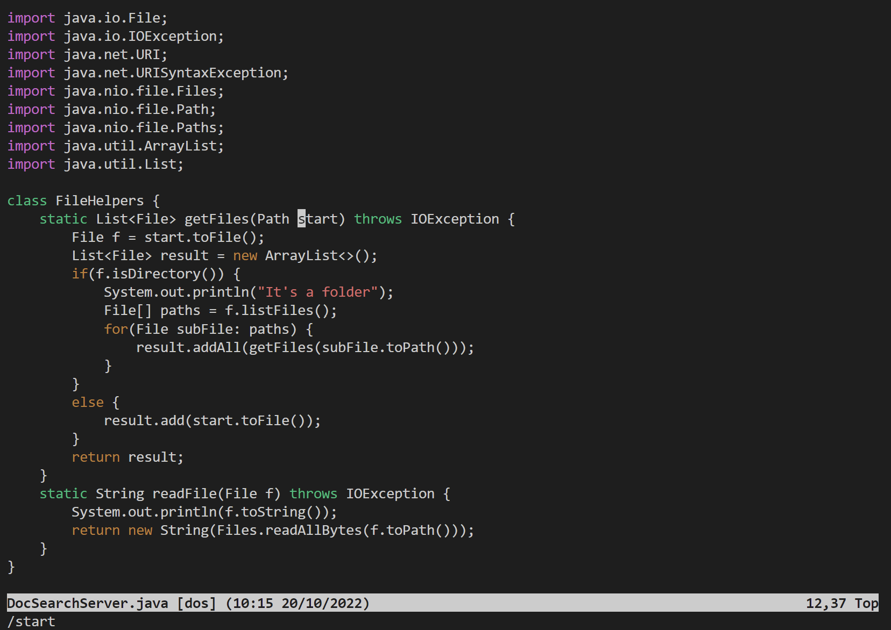
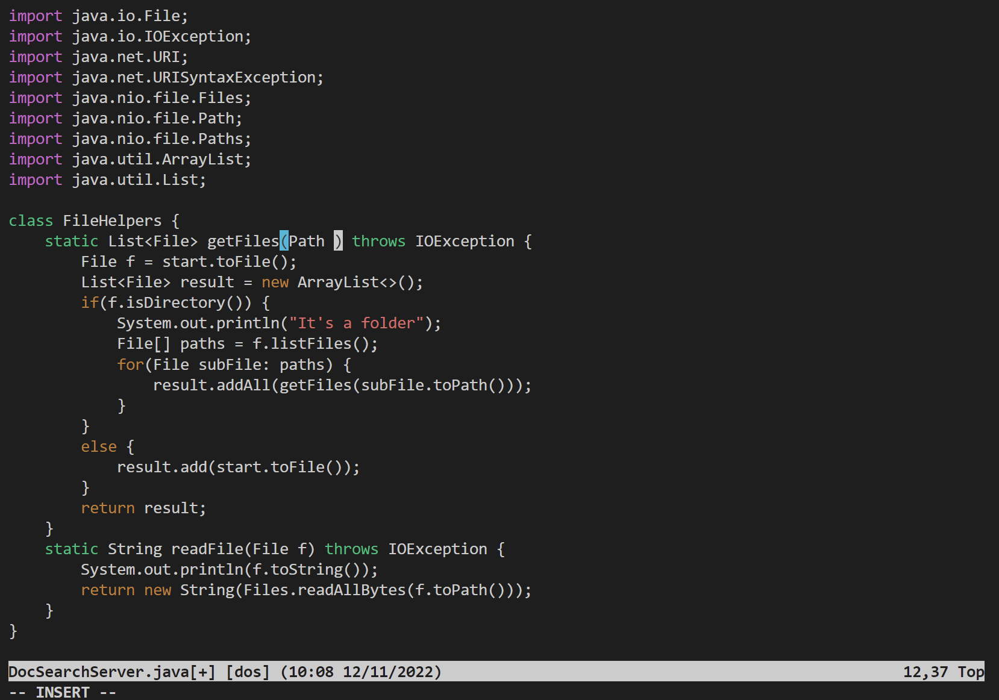
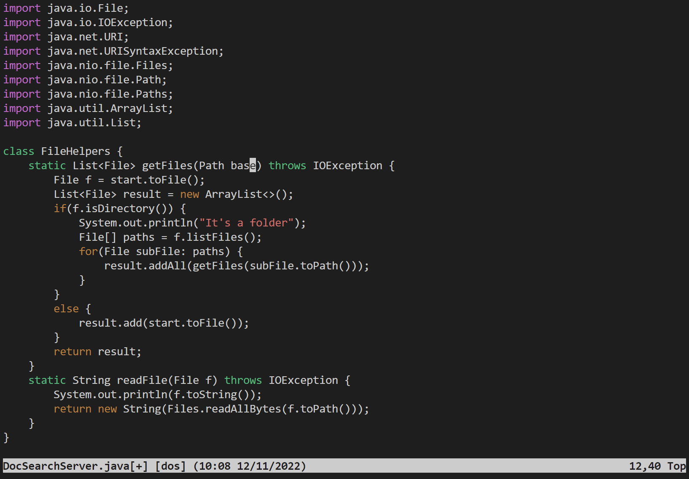
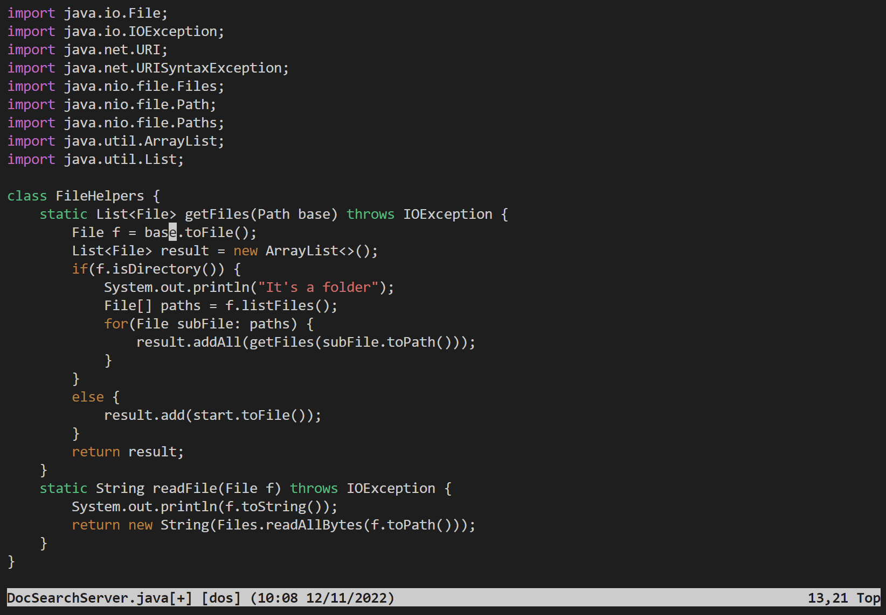

# Lab Report 4
## Part 1

Task:
Changing the name of the start parameter and its uses to base.

`vim<Space>d<TAB>s<Tab><Enter>`
File opened in vim.

`/start<Enter>`
Search for the *start* in the file and move the cursor to the start of the word.

`ce`
Delete the word and enter Insert Mode.

`base<esc>`
Add the word *base* and quit Insert Mode.

`n.`
Move to the next *start* and repeat the last command which is delete *start* and add *base*.

Repeat the last step two more times to replace all *start*.

`:wq`
This save the change and quit the vim.

## Part 2
I actually like to work on remote server directly because I don't need to scp all the files from time to time. Especially when there is a minor issue that need to be fixed, scp takes a lot of time and is inconvenient. I think it will be fine with both method if I was just working with a few files or a small file. But if it is a large project or a huge file. I will definitely choose to work remotely with vim. 
