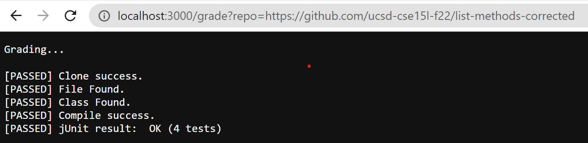
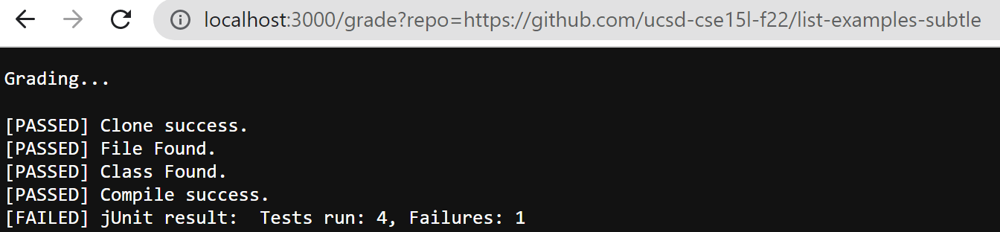
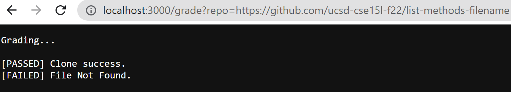

# Lab Report 5
## grade.sh code
```
FILE_NAME="ListExamples.java"
CLASS_NAME="class ListExamples"
CP=".;../lib/hamcrest-core-1.3.jar;../lib/junit-4.13.2.jar"

echo "Grading..."
echo ""

rm -rf student-submission
git clone $1 student-submission -q

if [[ $? -eq 0 ]]
then
  echo "[PASSED] Clone success."
else
  echo "[FAILED] Clone failed. Please check the URL."
  exit 1
fi

cd student-submission
cp ../TestListExamples.java .

if [[ -f $FILE_NAME ]]
then
  echo "[PASSED] File Found."
else
  echo "[FAILED] File Not Found."
  exit 1
fi

grep -q "$CLASS_NAME" ./$FILE_NAME

if [[ $? -eq 0 ]]
then
  echo "[PASSED] Class Found."
else
  echo "[FAILED] Class Not Found."
  exit 1
fi

javac -cp $CP *.java 2> compile_error.txt

if [[ $? -eq 0 ]]
then
  echo "[PASSED] Compile success."
else
  echo "[FAILED] Compile Failed."
  exit 1
fi

java -cp $CP org.junit.runner.JUnitCore TestListExamples > test_result.txt

if [[ $? -eq 0 ]]
then
  RESULT=`cat test_result.txt | grep "OK"`
  echo "[PASSED] jUnit result: " $RESULT
else
  RESULT=`cat test_result.txt | grep "Tests run:"`
  echo "[FAILED] jUnit result: " $RESULT
  exit 1
fi
```

## Report in browser




## Trace of the third screenshot
```
echo "Grading..."
echo ""
```
The standard output for these two are the script "Grading..." and an empty line. The return code is zero.

```
rm -rf student-submission
```
There is no output for this line and return code is zero.

```
git clone $1 student-submission -q
```
There is no output for this line successufully running and return code is zero.

```
if [[ $? -eq 0 ]]
then
  echo "[PASSED] Clone success."
else
  echo "[FAILED] Clone failed. Please check the URL."
  exit 1
fi
```
The if statement is true and the then part of this code block gets run and output is "[PASSED] Clone success." The rest of the lines will not run.

```
cd student-submission
cp ../TestListExamples.java .
```
These two commands have no standard output and the return code is zero.

```
if [[ -f $FILE_NAME ]]
then
  echo "[PASSED] File Found."
else
  echo "[FAILED] File Not Found."
  exit 1
fi
```
The if statement here is false because this repository named the file wrong. Therefore, the then part will not run and the else part will run. The output will be "[FAILED] File Not Found." and the return code is 1.